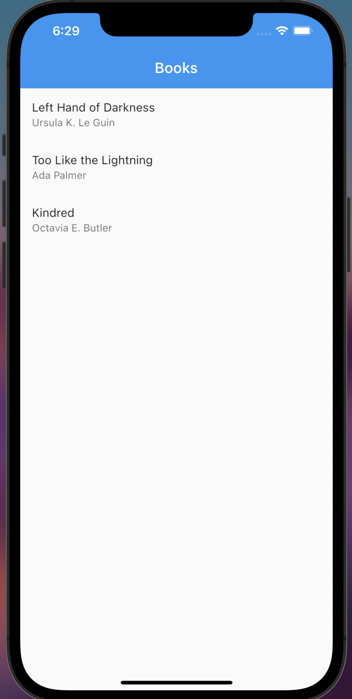

# Flutter Router 2 Practice

This is a project created to help understand the new flutter navigation way (flutter router 2.0).
It was created [Using this tutorial](https://medium.com/flutter/learning-flutters-new-navigation-and-routing-system-7c9068155ade)

## About

This is a basic books app. It contains a home page that lists 
a number of books by their titles and authors. It also contains
a detail page, which is just the title of the book at the center
of the page. Finally, it has an Unknown page that is shown
when a page is not found - the infamous 404 page.

The navigation folder contains all the navigation logic. Using Flutter 2.0's
declarative approach, it contains the router delegate (book router delegate), 
route information parser (book route information parser) and a custom data type 
(book route path). 

## Screenshots

On mobile phone, the screenshots are:

 
